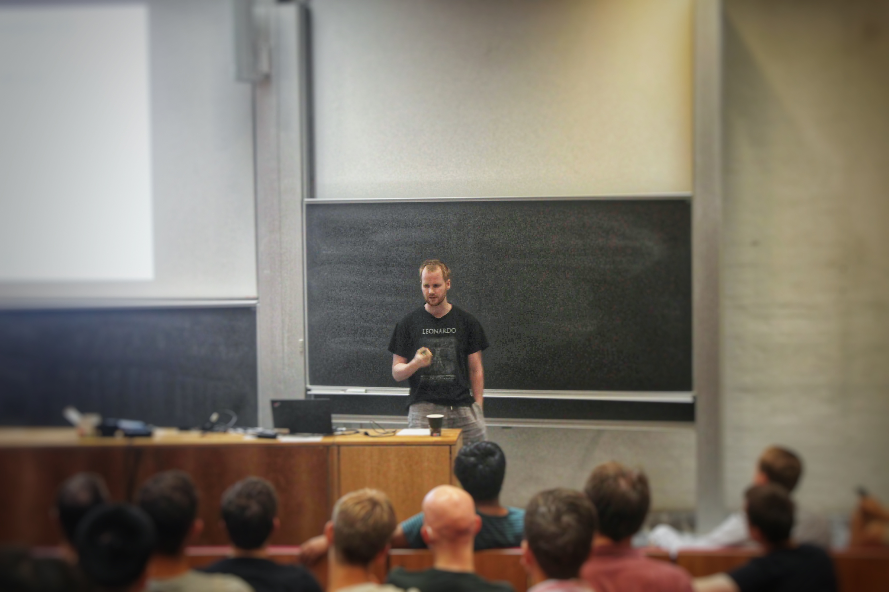

<!--
{: width="300" style="float: left; margin-right: 3em;"}
-->

{: width="80%" style="display: block; margin: 0 auto"}

# About 

I just completed a PhD at the University of Göttingen, working under the supervision of Thomas Schick. 
In plain language, I studied the underlying shape and symmetry of spacetime models and the mathematical structures that classify their properties.
More precisely, my research interests lie in algebraic topology, in particular twisted K-theory and topological T-duality.
My thesis work is about the equivariant versions of these concepts.

I'm now back in Melbourne and looking for opportunities to apply my hard-earned skills to solve real-world problems.

# Portfolio

- [Drug use in Victoria - Excel dashboard](/portfolio/drugs-victoria)

- [A Dive in the ArXiv: Gender Equality](/portfolio/arxiv-gender)

- [Who's Paying Our Pollies? A Peak Into the Transparency Register](/portfolio/political-donations)

- [Predicting AFL Matches](/portfolio/afl-prediction)
  
- [AFL SQL Queries](/portfolio/afl-sql)

# Papers

- [A fixed point decomposition of twisted equivariant K-theory](https://arxiv.org/abs/2202.05788) (with Thomas Schick and Mario Velásquez). Proc. Amer. Math. Soc. 151 (2023), 4593-4606

- [A new approach to topological T-duality for principal torus bundles](https://arxiv.org/abs/2104.05984) (with Thomas Schick). Submitted for publication.

- [Equivariant topological T-duality](https://arxiv.org/abs/2310.06064) (with Thomas Schick). Submitted for publication.

- [Twisted Equivariant Tate K-Theory](https://arxiv.org/abs/1912.02374) (Masters thesis)

