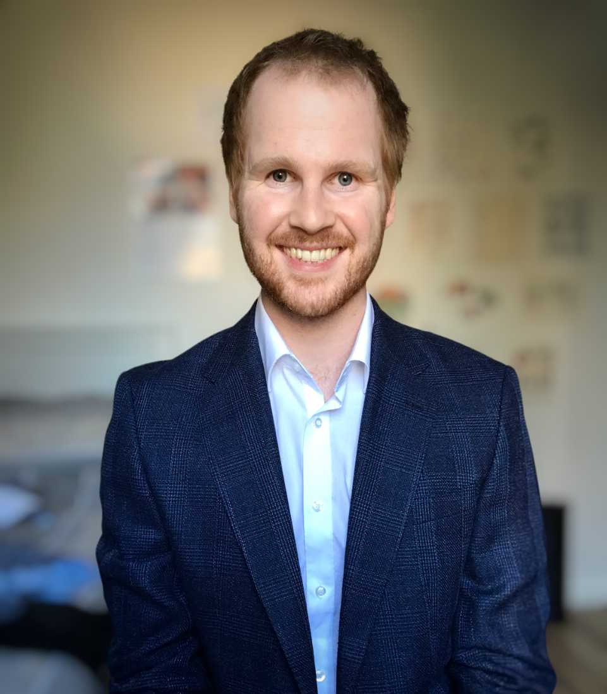
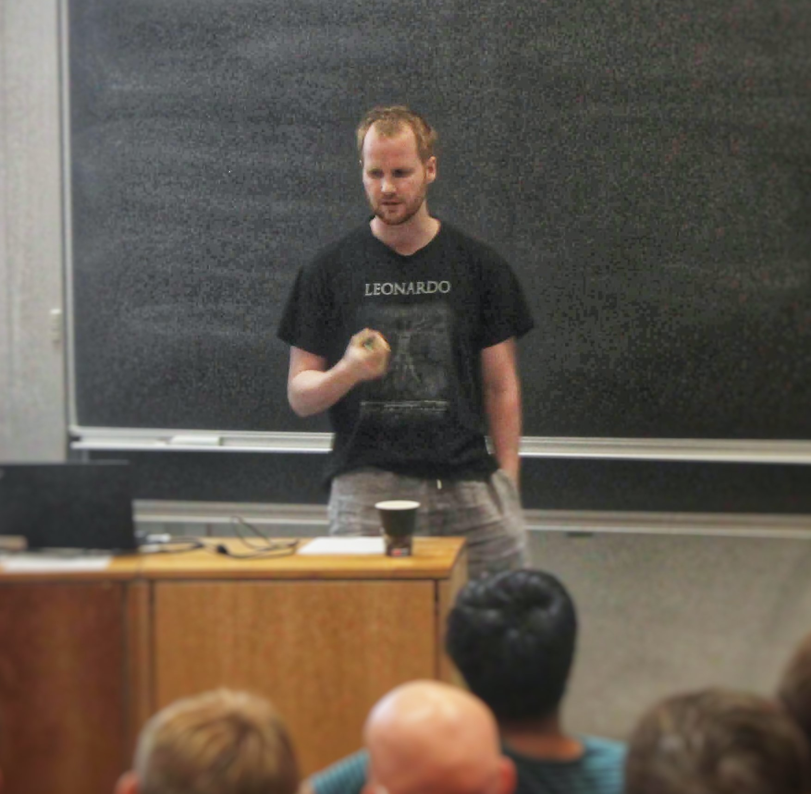

<!--
{: width="300" style="float: left; margin-right: 3em;"}
-->

<!--
{: width="60%" style="display: block; margin: 0 auto"}
-->

{: width="60%" style="display: block; margin: 0 auto"}

# About

I'm an experienced researcher with a mathematics and informatics background. I'm passionate about using my analytic, data and programming skills to solve real-world problems that make a positive impact.

I recently completed a PhD at the University of Göttingen, working under the supervision of Thomas Schick. 
In plain language, I studied the underlying shape and symmetry of spacetime models and the mathematical structures that classify their properties.
More precisely, my research interests lie in algebraic topology, in particular twisted K-theory and topological T-duality.
My thesis was about the equivariant versions of these concepts.

I'm now back in Melbourne and looking for opportunities to apply my unique blend of expertise to new and exciting problems.

# Portfolio

- [Quantium Virtual Internship](/TomJDove/portfolio/quantium) \\
Completed a job simulation focused on data analytics and commercial insights. 
Analysed transaction and customer data to give insights on customer segmentation and purchasing behaviour and identified benchmark stores for conducting uplift testing on trial stores.

- [AFL Power BI Report](/TomJDove/portfolio/afl-power-bi) \\
I created an interactive Power BI report to investigate AFL statistics at a season, team, and player level.

- [Drug use in Victoria - Excel dashboards](/TomJDove/portfolio/drugs-victoria) \\
    I created two Excel dashboards on drug use in Victoria using data on ambulance attendances and hospital admissions.

- [What the ArXiv metadata says about gender equality in mathematics](/TomJDove/portfolio/arxiv-gender) \\
    Using metadata on ArXiv, the largest repository of mathematical
research articles, I used author names to obtain an approximation of the proportion of mathematicians who are
women.

- [Who's paying our pollies? A dashboard on political donations in Australia](/TomJDove/portfolio/political-donations) \\
The Australian Electoral Commission publishes annual data on political
donations. I investigate the data and present a dashboard summarising the findings.

- [Using machine learning to predict AFL matches](/TomJDove/portfolio/afl-prediction) \\
I train a machine learning model to predict the outcome of an AFL match. 
  
- [AFL SQL demonstration](/TomJDove/portfolio/afl-sql) \\
I demonstrate my SQL competence by creating and querying a basic AFL database.

- [University projects](/TomJDove/portfolio/university-projects) \\
I describe some of the projects I did in university: an RPG game in Java, a multithreaded TCP server implementing a proof-of-work algorithm, a simple web application with a database backend, and a controller for a car to traverse a maze. 

# Education

- **Doctor of Philosophy (Mathematics)**, 2020-2023 \\
University of Göttingen, Germany \\
Authored three research articles and communicated findings in several talks.

- **Master of Science (Mathematics and Statistics) (with distinction)**, 2018-2020\\
University of Melbourne, Melbourne, Australia \\
Average grade of 91%.

- **Diploma of Informatics**, 2015-2017 \\
University of Melbourne, Melbourne, Australia \\
*Included courses: Software Modelling and Design, Models of Computation, Artificial Intelligence, Computer Systems, Database Systems, Object Oriented Software Development, Design of Algorithms*

- **Bachelor of Science (Mathematics and Statistics)**, 2015-2017 \\
University of Melbourne, Melbourne, Australia

# Research papers

- [A fixed point decomposition of twisted equivariant K-theory](https://arxiv.org/abs/2202.05788) (with Thomas Schick and Mario Velásquez). Proc. Amer. Math. Soc. 151 (2023), 4593-4606

- [A new approach to topological T-duality for principal torus bundles](https://arxiv.org/abs/2104.05984) (with Thomas Schick). Submitted for publication.

- [Equivariant topological T-duality](https://arxiv.org/abs/2310.06064) (with Thomas Schick). Submitted for publication.

- [Twisted Equivariant Tate K-Theory](https://arxiv.org/abs/1912.02374) (Masters thesis)

